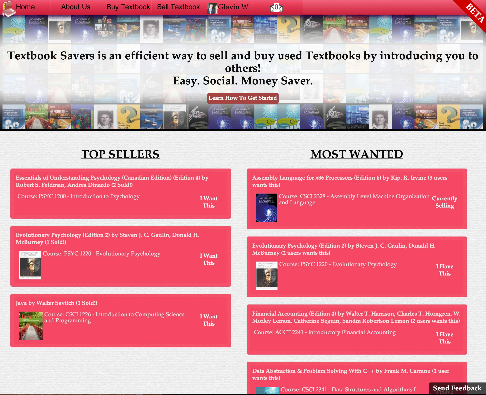
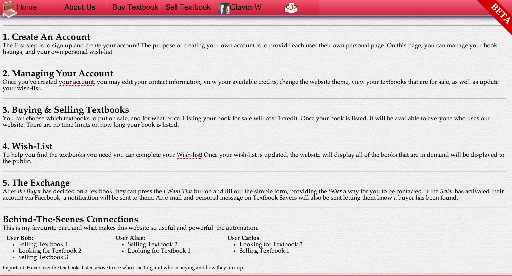
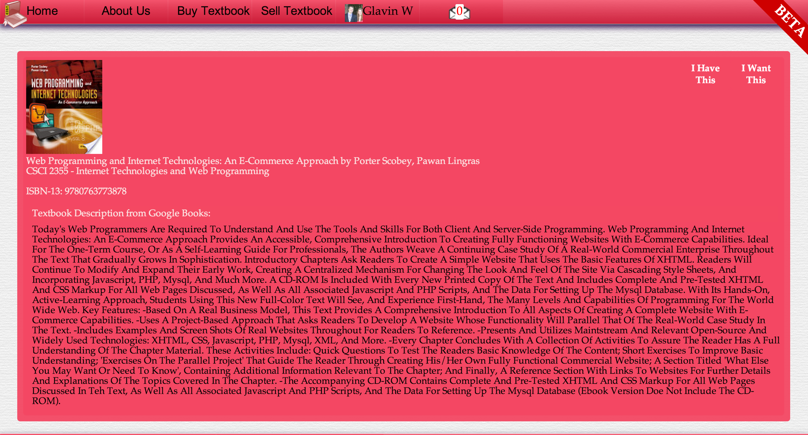
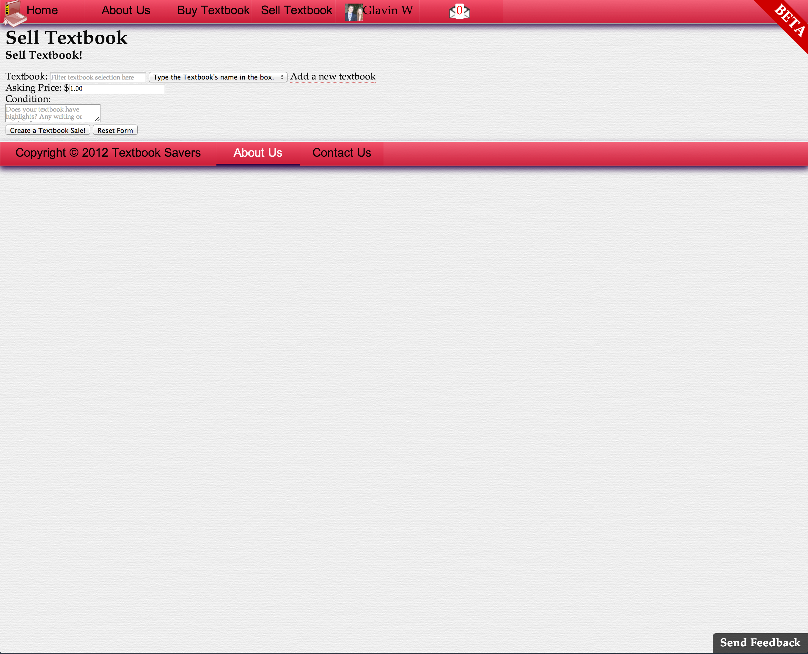
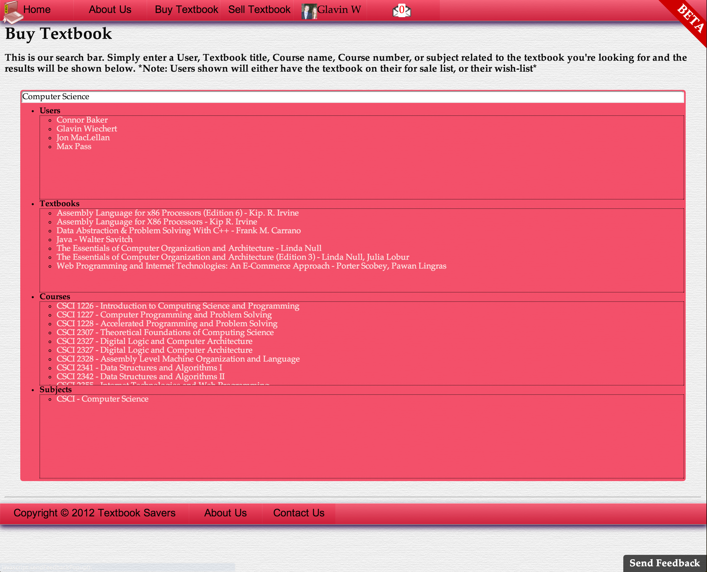
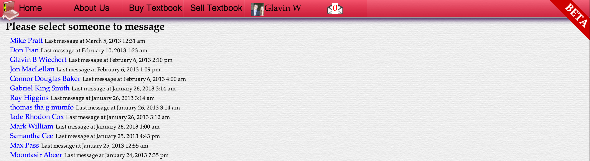
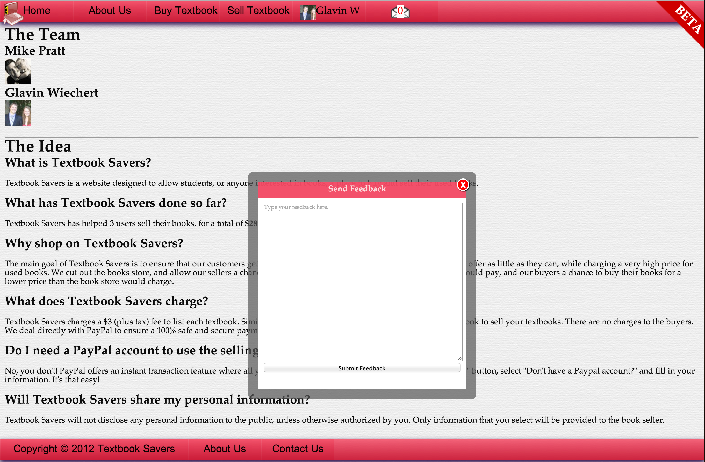

Textbook-Savers
===============

Textbook Savers is a website I worked on with my colleague and friend, Mike Pratt.

See http://cs.smu.ca/~g_wiechert/TextbookSavers/Home.php for live demo.

## Screenshots
### Home

### How It Works

### My Account

### Textbook Info

### Sell Textbook

### Buy Textbook

### Messenger

### Feedback

